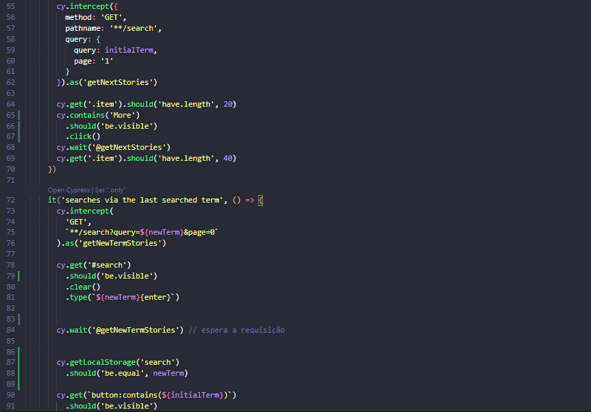
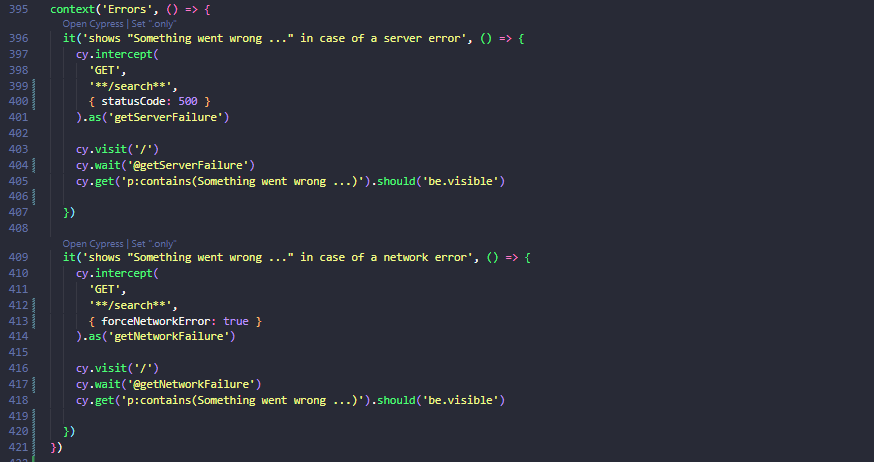

# Talking About Testing | Cypress Avançado

 
> Explorando o Cypress para automação de testes funcionais de Interface Gráfica de Usuário (GUI) e API REST

 Projeto realizado durante o curso **Cypress Avançado** da escola online **Talking About Testing**.
 
## 📚 Tópicos

- Como criar testes 100% flakiness-free
- Como interagir com a aplicação o mais próximo de como um usuário real faria
- Como esperar por um elemento estar visível antes de interagir com ele
- Como simular o uso do teclado em vez de clique em botão em funcionalidades de busca
- Como esperar por requisições HTTP antes de seguir em frente com os testes
- Como organizar diferentes testes em seus específicos contextos
- Como ler o localStorage do navegador
- Como tornar seletores de elementos mais específicos
- Como simplificar comandos repetitivos
- Como interceptar e mockar uma API externa para testar o frontend independente do backend
- Como simular erros no servidor e na rede
- Como simular lentidão na chamada à uma API
- Como modificar o relatório de testes padrão

## 🔧 Ferramentas e Tecnologias

- Cypress (`v6.6.0`)
- Cypress Local Storage Commands (`v1.4.1`)
- Faker (`v5.4.0`)
- StandardJS (`v1.0.0`)
- Node.js (`v14.15.4`)
<<<<<<< HEAD
- npm (`v6.14.11`)
=======
- npm (`v6.14.11`) 
>>>>>>> 29054f1c5a7ebfb0719beea5e93a7f60e6e2e8b6

## 🔧 Instalação

Execute `npm install` para instalar as dependências de dev.

## 🔧 Testes

Você pode executar testes simulando uma viewport desktop ou mobile:

- ### Desktop

	Execute `npm test` para executar o teste no modo headless.

	Ou `npm run cy:open` para executar o teste no modo interativo.

- ### Mobile

	Execute `npm test:mobile` para executar o teste no modo headless.

	Ou `npm run cy:open:mobile` para executar o teste no modo interativo.

## 🔗 Contato

mykallella@gmail.com
